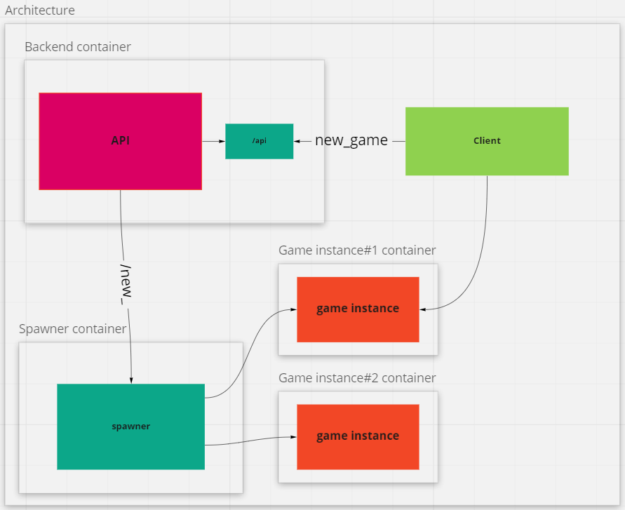

# Typing game

# Projects

`frontend` - client for `backend`

`backend` - authorization server. This component can request game instances from a `spawner` (game instance manager). Allows new users to register, log in already registered, stores all information about users.

`spawner` - `game instance`s manager. Launches game instances upon request from the authorization server.

`game instance` - A dedicated game server to which players connect to.

