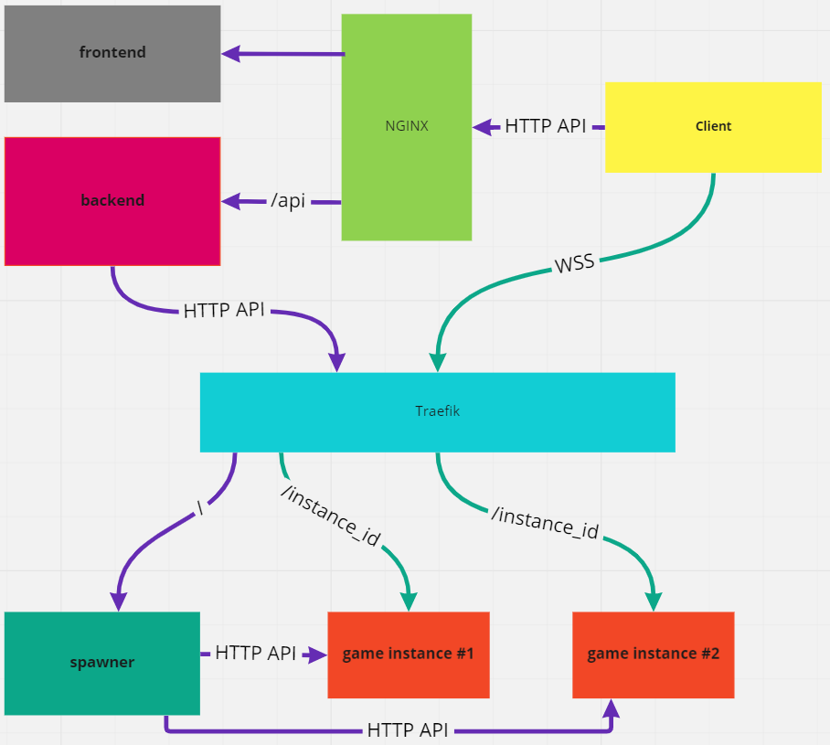

# Typing game

# Projects

`frontend` - client for `backend`

`backend` - responsible for authorization, matchmaking, storing and retrieving players statistics and replays. Requests game instances from a `spawner` (game instance manager).

`spawner` - `game instance` manager. Launches game instances upon request from the `backend`.

`game instance` - A dedicated instance where the game takes place.

